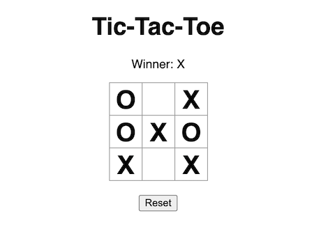

# TicTacToe

This is a revised implementation of the original [TicTacToe game](https://github.com/abayomipopoola/tictactoe/tree/single-player), written in Go/HTMX.

## Features & Functionality

I've enhanced the original game with multiplayer functionality over a network, leveraging the long-polling technique for client-server communication.

The choice of long-polling over WebSockets is due to its simplicity and the application's short-lived nature. While WebSockets provide real-time updates, their setup and maintenance can be more complex and resource-intensive, especially for apps that don't require continuous real-time feedback.

However, long-polling comes with a challenge: the possibility of missing game events during brief disconnections. To mitigate this, I implemented a simple PubSub &  Message Queue system on top of the long-polling technique. This guarantees that clients can recover any missed game events upon reconnection. Clients send the timestamp of their last received message to ensure synchronization, allowing the server to deliver any updates missed during disconnections.

### Server

The server is written in [Go](https://go.dev), not just for its simplicity and conciseness, but also its built-in concurrency and a robust standard library. Making it easier to implement simple long-polling server with a message queue logic to handle missing game events in case of connection drop -- without using third-party linraries.

The server is written in Go, not only for its simplicity and conciseness but also because of its native concurrency support and a comprehensive standard library. These features make it straightforward to implement a long-polling server with a message queue mechanism. This ensures uninterrupted gameplay, even if a connection drops—all without relying on third-party libraries.

For a detailed code walkthrough, refer to this [tutorial](https://github.com/abayomipopoola/tictactoe/tree/single-player)

### Client

[HTMX](https://htmx.org) is the main reason for this simple game. HTMX is a fascinating project because it allows developers to access modern web features directly from HTML, sidestepping the complexity of traditional JavaScript frameworks. This makes web interactivity and AJAX integrations simpler, lighter, and more maintainable. 

Using HTMX can result in faster development, improved performance, and a more direct connection between your server-side code and the front-end.

For a detailed code walkthrough, refer to this [tutorial](https://github.com/abayomipopoola/tictactoe/tree/single-player)